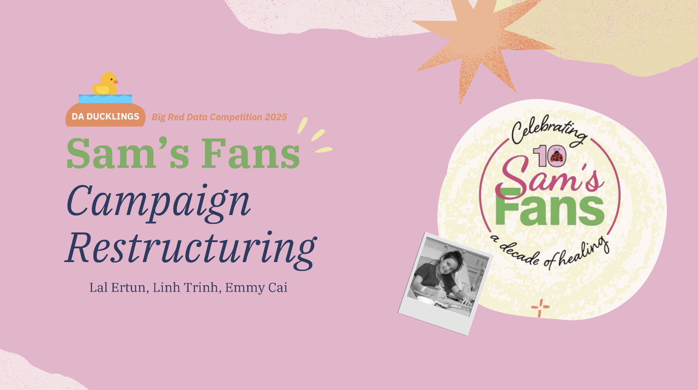

# BRD25-DD
Big Red Data 2025 Competition - DA Ducklings

### Sam's Fans Restructuring Year-End Campaign

+ Final Rank: Honourable Mention
+ Submission Date: April 13, 2025

#### Members

- Linh Trinh
- Emmy Cai
- Lal Ertun

### Quick Links

+ Presentation Slides: https://www.canva.com/design/DAGkXPLCdzQ/Ly5cuvj6OLNwDTd5tU681A/edit?utm_content=DAGkXPLCdzQ&utm_campaign=designshare&utm_medium=link2&utm_source=sharebutton 
+ Full Report: 
+ Competition Page: ?

### Overview

Our data analysis aims to project the performance of both the Thread of Hope (ToH) Campaign (a unique one-time effort) and the recurring End of Year (EoY) Campaign. By examining 10 years of historical campaign data, we identified peak donation periods, successful tactics, and engagement trends.
